#最小生成树
###简介
 >一个有 n 个结点的连通图的生成树是原图的极小连通子图，且包含原图中的所有 n 个结点，并且有保持图连通的最少的边。 最小生成树可以用**kruskal**（克鲁斯卡尔）算法或**prim**（普里姆）算法求出。
***

## kruskal
***
**算法描述**：
>克鲁斯卡尔算法需要对图的边进行访问，所以克鲁斯卡尔算法的时间复杂度只和边又关系，可以证明其时间复杂度为O（eloge）。

**算法过程**：
>1.将图各边按照权值进行排序
2.将图遍历一次，找出权值最小的边，（条件：此次找出的边不能和已加入最小生成树集合的边构成环），若符合条件，则加入最小生成树的集合中。不符合条件则继续遍历图，寻找下一个最小权值的边。
3.递归重复步骤1，直到找出n-1条边为止（设图有n个结点，则最小生成树的边数应为n-1条），算法结束。得到的就是此图的最小生成树。

**算法图示**

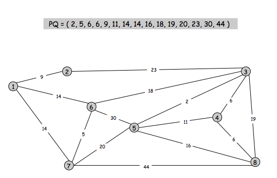
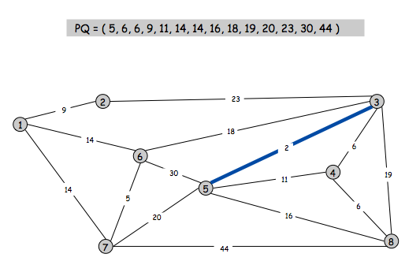
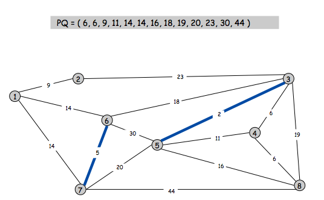
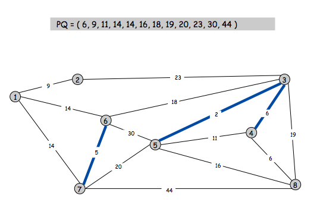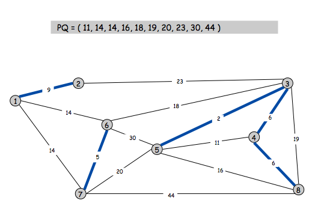
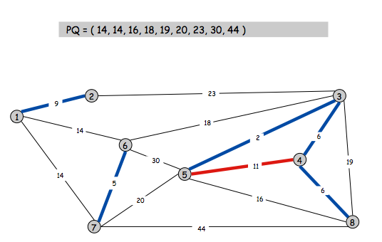
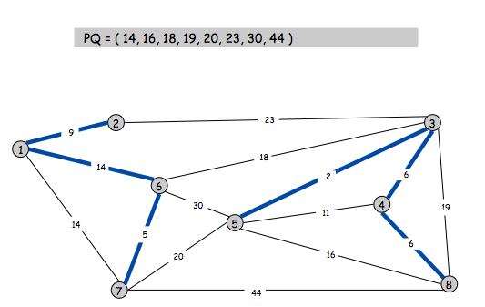
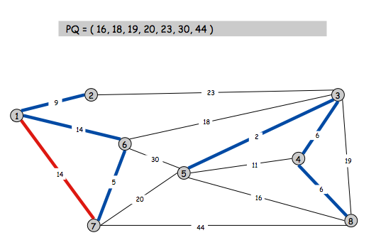
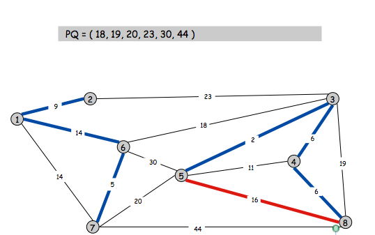
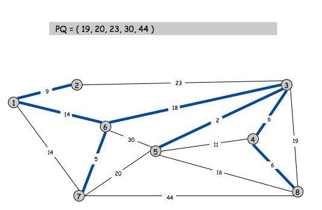
****
****

**算法代码**
```
   
    #include<iostream>
    #include<algorithm>
    using namespace std;
    const int maxv = 1000;
    const int maxe = 500000;
    struct node{
    int frm,to,value;
    bool operator < (node temp){
        return  value < temp.value;
    }
    }Edge[maxe];
    int fa[maxv];
    int find(int x){
    if(fa[x]!= x){
        fa[x] = find(fa[x]);
    }
    return fa[x];
    }
    int main(){
    
    int n,m;
    cin >> n >> m;
    int ans = 0;
    for(int i = 0 ; i < m;i++)
    {
        cin >> Edge[i].frm >> Edge[i].to >>Edge[i].value;
    }
    for(int i = 0; i < n;i++){
        fa[i] = i;
    }
    sort(Edge,Edge+m);
    for(int i = 0 ; i<m;i++){
        int fx = find(Edge[i].frm),fy = find(Edge[i].to);
        if (fx != fy) {
            ans+=Edge[i].value;
            fa[fx] = fy;
        }
    }
    cout << ans <<endl;
    return 0;
    }

##Prim
***
**基本思想：** 	
>对于图G而言，V是所有顶点的集合；现在，设置两个新的集合U和T，其中U用于存放G的最小生成树中的顶点，T存放G的最小生成树中的边。 从所有uЄU，vЄ(V-U) (V-U表示出去U的所有顶点)的边中选取权值最小的边(u, v)，将顶点v加入集合U中，将边(u, v)加入集合T中，如此不断重复，直到U=V为止，最小生成树构造完毕，这时集合T中包含了最小生成树中的所有边。

**算法图示:**
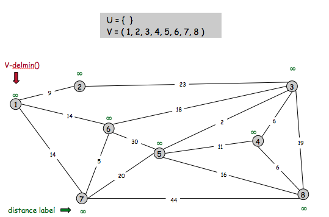
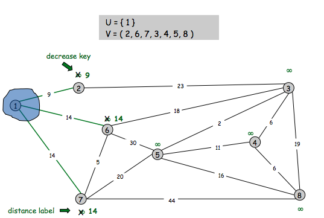
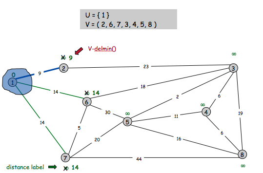
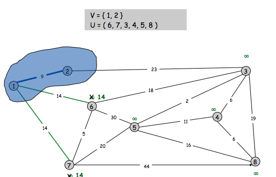
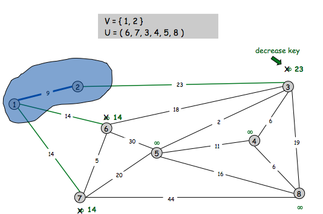

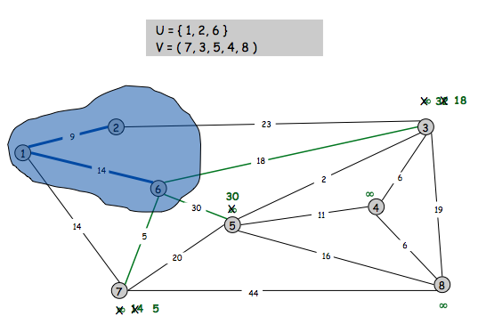
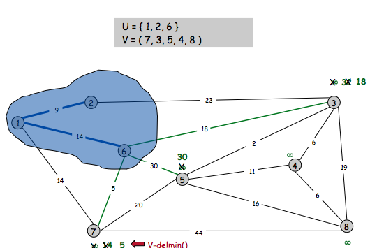
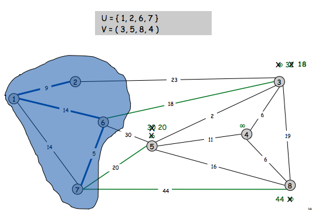

 *以此类推 *

**算法代码：**
>在普里姆算法中，为了便于在集合U和(V-U)之间选取权值最小的边，需要设置两个辅助数组closest和lowcost，分别用于存放顶点的序号和边的权值。
> 对于每一个顶点v∈V-U，closest[v]为U中距离v最近的一个邻接点，即边 (v，closest[v]) 是在所有与顶点v相邻、且其另一顶点j∈U的边中具有最小权值的边，其最小权值为lowcost[v]，即lowcost[v]=cost[v][closest[v]]，

``` 

    #include<iostream>
    #include<cstdio>
    using namespace std;
    const int MAXN = 1000;
    const int INF = 1<<30;
    int closest[MAXN], lowcost[MAXN], m;//m为节点的个数
    int G[MAXN][MAXN];//邻接矩阵
    int prim()
    {
    for(int i = 0;i < m;i++)
    {
        lowcost[i]=INF;
    }
    for(int i = 0;i < m;i++)
    {
        closest[i]=0;
    }
    
    closest[0]=-1;//加入第一个点，-1表示该点在集合U中，否则在集合V中
    int num=0,ans=0,e=0;//e为最新加入集合的点
    
    while(num<m-1)//加入m-1条边
    {
        int micost= INF,miedge=-1;
        for(int i=0;i < m;i++){
            if(closest[i]!=-1)
            {
                int temp=G[e][i];
                if(temp<lowcost[i])
                {
                    lowcost[i]=temp;
                    closest[i]=e;
                }
                if(lowcost[i]<micost)
                    micost=lowcost[miedge=i];
            }
        }
        ans+=micost;
        closest[miedge]=-1;
        closest[e=miedge]=-1;
        num++;
    }
    return ans;
    }
```
***
**注意：**
>prim算法适合稠密图，其时间复杂度为O(n^2)，其时间复杂度与边得数目无关，而kruskal算法的时间复杂度为O(eloge)跟边的数目有关，适合稀疏图。
